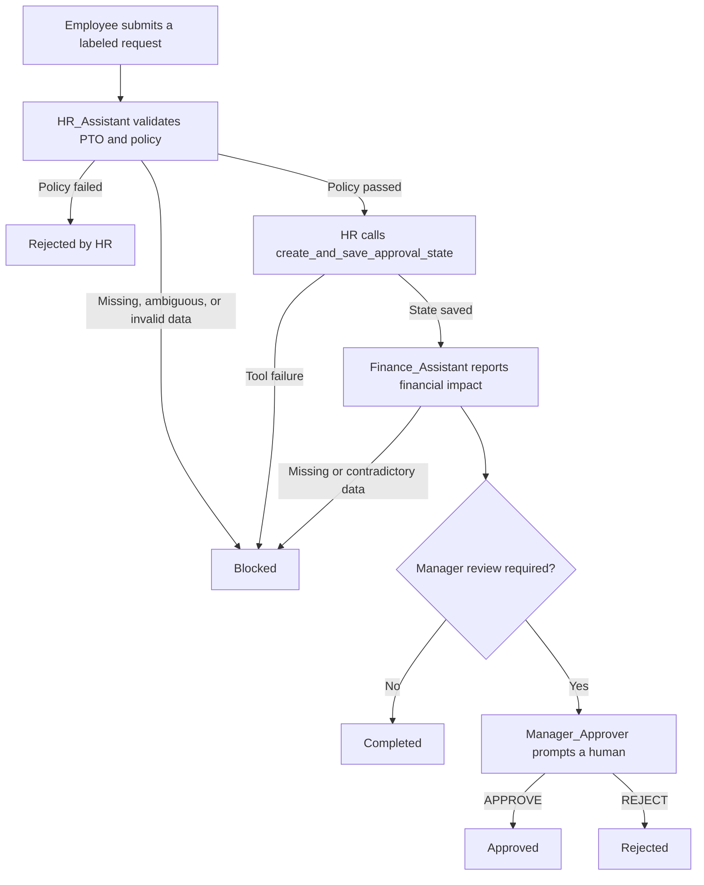

# Collaborative Business Agents

This project is a console demonstration of a centrally orchestrated,
human-in-the-loop leave-request workflow built with Microsoft AutoGen AgentChat
0.7.5 and Azure OpenAI. An employee request moves sequentially through HR policy
validation, financial-impact reporting, and—only when the deterministic business
rules require it—human manager review.

The implementation has two LLM-backed agents and one human proxy participant.
It does **not** have three AI agents.

## Participants and state

| Name | Implementation | Responsibility |
| --- | --- | --- |
| `HR_Assistant` | `AssistantAgent` | Applies the supplied PTO and leave policy, then calls `create_and_save_approval_state` after a successful HR check. |
| `Finance_Assistant` | `FinanceProtocolAgent`, a custom `BaseChatAgent` wrapping a separate `AssistantAgent` | Uses the saved state and HR handoff to report requested days, daily cost, total cost, and remaining department budget. Its routing header is enforced by Python. |
| `Manager_Approver` | `UserProxyAgent` | Prompts a human manager to approve or reject a request that requires review. It is not LLM-backed. |

`Employee` is the source of the incoming `TextMessage`; it is not a registered
agent or member of the team. `WorkflowState`, the tool functions, and the
`SelectorGroupChat` team are supporting program components, not AI agents.

## Orchestration

AutoGen AgentChat 0.7.5's `SelectorGroupChat` provides the team orchestration
that replaces the earlier `GroupChat` and `GroupChatManager` design. The team
registers only `HR_Assistant`, `Finance_Assistant`, and `Manager_Approver`.

Although `SelectorGroupChat` can ask a model to select a speaker, this program
does not use model-based routing. `LeaveWorkflow.select_next_speaker` calls the
central `_route` function, which always returns the exact next participant name
for a valid continuing workflow:

```text
Employee -> HR_Assistant -> Finance_Assistant -> Manager_Approver (when required)
```

The same `_route` function powers a `FunctionalTermination` condition. It stops
the team when HR rejects the request, either LLM-backed participant reports a
blocked result, Finance completes a request that needs no manager, or the
manager records a final decision. Routing also validates the actual message
source, structured labels, HR completion contract, saved state, and manager
decision. A routing error is converted to a `Blocked` workflow outcome by the
termination condition. The team also sets `max_turns=6` and
`allow_repeated_speaker=False`.

Routable final text messages begin with:

```text
[From: <sender>][Task: <task>][Status: <status>][Next: <participant-or-End>]
```

Tool-call and input-request events are not treated as final chat messages and do
not need this header. For Finance responses that are not explicitly blocked,
`FinanceProtocolAgent` replaces the LLM's routing header with one derived from
the saved Python state. In AgentChat 0.7.5, returning `None` from the selector
would fall back to model-based selection, so termination is handled separately
and the selector never intentionally returns `None`.

## Approval state and business rules

Each `LeaveWorkflow` owns one `WorkflowState` containing:

* `approval_state`: validated request data and the manager-review decision
* `hr_policy_passed`: `True`, `False`, or `None` before HR has been evaluated
* `outcome`: the workflow-level result
* `stop_reason`: the reason the team stopped

`create_approval_state(leave_type, requested_days, daily_cost)` validates its
inputs and returns a new dictionary. The leave type must be nonempty, requested
days must be a positive whole number, and daily cost must be finite and
nonnegative. It calculates `estimated_cost` as the rounded product of requested
days and daily cost, then applies the manager-review rules.

Manager review is required when **either** condition is true:

* `estimated_cost >= $1,500.00`
* after trimming whitespace and comparing case-insensitively, `leave_type` is
  exactly `extended leave`, `unpaid leave`, or `policy exception`

`WorkflowState.create_and_save_approval_state(...)` calls that function and
saves the result for the current workflow. An identical retry is allowed and
does not reset an existing manager decision; attempting to save different
request data raises an error. Its JSON result confirms whether the state was
saved so HR can complete its handoff.

Saving a request does **not** approve it. A request requiring manager review is
saved with `decision: "Pending"`; a request not requiring review is saved with
`decision: "Not Required"`. Only the human input collected by
`Manager_Approver` can change a pending decision to `Approved` or `Rejected`.

## Workflow



The sequence is:

1. `LeaveWorkflow.run` wraps the submitted request in a `TextMessage` whose
   source is `Employee`. The request must be labeled `Ready` and routed to HR.
2. `HR_Assistant` checks requested hours against available PTO and applies the
   policy included in the request. It must not invent missing data. Requests
   that cannot be expressed as positive whole days are blocked.
3. If policy passes, HR makes an actual tool call to
   `create_and_save_approval_state`; merely mentioning the function is not
   sufficient. HR can hand off to Finance only after the tool confirms the save.
4. `Finance_Assistant` produces the financial report. The custom wrapper uses
   the saved state to force either `Complete -> End` or
   `Approval Required -> Manager` routing.
5. If review is required, the console pauses for the manager. Input is
   case-insensitive and accepts `APPROVE`, `APPROVED`, or `A`, and `REJECT`,
   `REJECTED`, or `R`; invalid input is requested again.
6. The exact workflow outcomes are:
   * `Completed` when HR and Finance finish and manager review is not required
   * `Rejected by HR` when the policy check fails
   * `Approved` or `Rejected` after required human review
   * `Blocked` for missing or ambiguous information, a tool or protocol error,
     contradictory financial data, or a premature team stop

Create a new `LeaveWorkflow` for every request. A workflow instance can be run
only once.

## Prerequisites

* Python 3.10 or later
* An Azure OpenAI resource and API key
* An Azure OpenAI deployment for a model that supports tool calling
* A terminal where a manager can enter a decision for flagged requests

The implementation pins both AutoGen packages to 0.7.5. Install the dependencies
used by the script with:

```bash
python -m pip install "autogen-agentchat==0.7.5" "autogen-ext[openai]==0.7.5" python-dotenv
```

`autogen-agentchat` and `autogen-ext[openai]` install the `autogen-core`
dependency used by the script's core model and message imports.

## Setup and execution

1. Create and activate a virtual environment.

   Windows PowerShell:

   ```powershell
   py -m venv .venv
   .\.venv\Scripts\Activate.ps1
   ```

   macOS or Linux:

   ```bash
   python3 -m venv .venv
   source .venv/bin/activate
   ```

2. Install the dependencies using the command above.

3. Create a `.env` file beside `collaborative_business_agents.py`, or define the
   same variables in the process environment:

   ```env
   AZURE_OPENAI_API_KEY=your-api-key
   AZURE_OPENAI_ENDPOINT=https://your-resource-name.openai.azure.com/
   AZURE_OPENAI_DEPLOYMENT=your-deployment-name
   API_VERSION=your-supported-api-version
   AZURE_OPENAI_MODEL=your-underlying-model-name
   ```

   `AZURE_OPENAI_API_KEY`, `AZURE_OPENAI_ENDPOINT`, and
   `AZURE_OPENAI_DEPLOYMENT` are required. Set either `API_VERSION` or
   `AZURE_OPENAI_API_VERSION`; `API_VERSION` takes precedence when both exist.
   `AZURE_OPENAI_MODEL` is optional when the deployment name is also a
   recognized model name, but it must identify the underlying model when the
   Azure deployment uses a custom alias.

   The repository's `.gitignore` excludes `.env`. Never commit keys, tokens, or
   other credentials.

4. Run the example:

   ```bash
   python collaborative_business_agents.py
   ```

No live Azure call is needed for syntax checks, but executing the workflow does
call the configured Azure OpenAI deployment.

## Included example and expected output

`EXAMPLE_REQUEST` submits 40 hours (five eight-hour days) of paid leave for
September 14 through September 18, 2026. It supplies 80 hours of available PTO,
a daily employee cost of `$320`, a department leave-impact budget of `$10,000`,
and a policy allowing requests of 12 days or fewer when sufficient PTO is
available.

For that data, HR should pass the policy check and save a canonical estimated
cost of `$1,600`. Finance should report `$8,400` remaining in the supplied
budget. Because `$1,600 >= $1,500`, the deterministic state requires manager
review and the application prints:

```text
Manager Approval Needed - Task Paused
```

The human manager then enters an approval or rejection. LLM wording may vary,
but the final console section includes the workflow outcome, stop reason, and a
JSON `Saved approval state` containing these fields:

```json
{
  "leave_type": "paid leave",
  "requested_days": 5,
  "daily_cost": 320,
  "required": true,
  "reason": "Estimated cost $1,600.00 meets or exceeds the $1,500.00 approval threshold.",
  "estimated_cost": 1600.0,
  "decision": "Approved or Rejected, according to the human input"
}
```

The authoritative in-process location is
`workflow.state.approval_state`. It exists only in memory and is printed before
the program exits.

## Current limitations

* This is an in-memory, single-request console example, not a production service.
* The example request is defined directly in the Python source.
* State and chat history are not persisted after the process exits.
* The program does not update an HR database, payroll system, calendar, or other
  external business system.
* Manager review requires synchronous terminal input; there is no web approval
  interface or durable audit workflow.
* Model-produced policy explanations and finance narrative can vary and still
  depend on the quality and consistency of the supplied request data.

## Project structure

```text
collaborative-business-agents/
|-- collaborative_business_agents.py  # Workflow, agents, state, and example
|-- README.md                          # Project documentation
`-- .gitignore                         # Excludes local secrets and Python artifacts
```

## Author

**Michael Lewis**, AI Systems Engineer, Synthetic OS Labs —
[GitHub: mdlewis365](https://github.com/mdlewis365)
