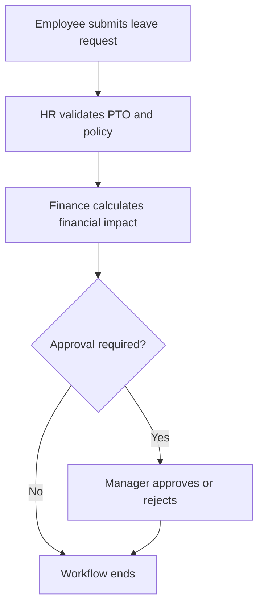

# Collaborative Business Agents

A governed multi-agent workflow that processes employee paid-leave requests through HR validation, financial analysis, and human manager approval.

Built with Python, AutoGen, and Azure OpenAI, this project demonstrates how specialized AI agents can collaborate sequentially while deterministic controls enforce routing, message structure, and approval requirements.

## Workflow



## Agents and Components

| Component           | Responsibility                                          |
| ------------------- | ------------------------------------------------------- |
| `Employee`          | Submits the initial paid-leave request                  |
| `HR_Assistant`      | Checks PTO availability and applies the leave policy    |
| `Finance_Assistant` | Calculates leave cost and remaining departmental budget |
| `Manager_Approver`  | Collects a human approval or rejection when required    |
| `Workflow_Manager`  | Coordinates the group chat and sequential handoffs      |

## Key Features

* Specialized agents with clearly separated responsibilities
* Sequential HR-to-Finance workflow
* Human-in-the-loop approval checkpoint
* Deterministic approval rules
* Custom speaker-selection logic
* Structured inter-agent message protocol
* Validation of agent handoffs
* Automatic correction of Finance routing labels
* Azure OpenAI integration
* Environment-variable protection for credentials
* Prevention of repeated speakers and uncontrolled agent loops

## Structured Message Protocol

Every workflow message must begin with the following structure:

```text
[From: <sender>][Task: <task>][Status: <status>][Next: <agent>]
```

The program parses and validates these labels before selecting the next speaker. If an agent returns an incorrectly formatted message or attempts an invalid handoff, the workflow stops or applies a deterministic correction.

## Approval Rules

Manager approval is required when either of the following conditions is true:

* The estimated financial impact is at least `$1,500`
* The request involves extended leave, unpaid leave, or a policy exception

The included example requests five paid-leave days at `$320` per day:

```text
5 days × $320 = $1,600
```

Because `$1,600` exceeds the approval threshold, the workflow pauses and asks a human manager to type `APPROVE` or `REJECT`.

The manager’s decision is then recorded as the final workflow outcome.

## Technologies

* Python
* [Microsoft AutoGen 0.2](https://microsoft.github.io/autogen/0.2/)
* Azure OpenAI
* `python-dotenv`
* Regular expressions for protocol validation

> This project uses AutoGen’s classic `autogen` API and therefore requires the AutoGen 0.2-compatible package.

## Getting Started

### Prerequisites

* Python 3.8 through 3.12
* An Azure OpenAI resource
* An Azure OpenAI model deployment
* Azure OpenAI API credentials

### 1. Create a Virtual Environment

Windows PowerShell:

```powershell
py -m venv .venv
.\.venv\Scripts\Activate.ps1
```

macOS or Linux:

```bash
python3 -m venv .venv
source .venv/bin/activate
```

### 2. Install Dependencies

```bash
python -m pip install --upgrade pip
pip install "autogen-agentchat~=0.2" python-dotenv
```

The version requirement follows the official [AutoGen 0.2 installation guide](https://microsoft.github.io/autogen/0.2/docs/installation/).

### 3. Configure Environment Variables

Create a `.env` file in the project directory:

```env
AZURE_OPENAI_API_KEY=your-api-key
AZURE_OPENAI_ENDPOINT=https://your-resource-name.openai.azure.com/
API_VERSION=your-supported-api-version
AZURE_OPENAI_DEPLOYMENT=your-deployment-name
```

Do not commit the `.env` file to GitHub.

### 4. Run the Application

```bash
python collaborative_business_agents.py
```

When the workflow reaches the manager checkpoint, enter one of the following decisions:

```text
APPROVE
```

or:

```text
REJECT
```

## Example Scenario

The included scenario processes the following request:

* Requested leave: 40 hours
* Leave dates: September 14–18, 2026
* Available PTO: 80 hours
* Daily employee cost: `$320`
* Departmental budget: `$10,000`
* Estimated leave cost: `$1,600`
* Estimated remaining budget: `$8,400`

The expected sequence is:

1. The employee submits the request to HR.
2. HR validates the PTO balance and leave policy.
3. HR forwards the financial information to Finance.
4. Finance calculates the cost and budget impact.
5. The deterministic approval rule identifies that manager approval is required.
6. The workflow pauses for a human decision.
7. The manager approves or rejects the request.

## Customizing the Scenario

The financial approval threshold can be changed here:

```python
APPROVAL_COST_THRESHOLD = 1500.00
```

Special leave categories can be changed in:

```python
SPECIAL_LEAVE_TYPES = {
    "extended leave",
    "unpaid leave",
    "policy exception",
}
```

The demonstration request can be modified in the employee’s initial message and in the approval-state configuration.

> The current prototype represents the request in both `approval_state` and the employee message. Update both locations together so the deterministic approval calculation remains consistent with the submitted request.

## Security

Add the following entries to `.gitignore` before publishing the project:

```gitignore
.env
.venv/
venv/
__pycache__/
*.py[cod]
```

Never commit Azure API keys, authentication tokens, or other credentials.

## Current Scope

This project is a command-line demonstration of collaborative agent orchestration and human-in-the-loop governance. The example scenario is currently configured directly in the Python source, and workflow results are not stored in a database.

Future extensions could include:

* External request input
* Persistent workflow history
* Automated tests
* Web-based manager approval
* Configurable business policies
* Multiple simultaneous requests
* Audit logging and reporting

## Author

**Michael Lewis**
AI Systems Engineer, Synthetic OS Labs
[GitHub: mdlewis365](https://github.com/mdlewis365)